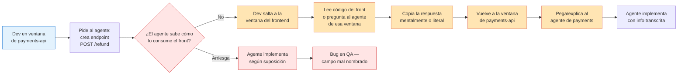
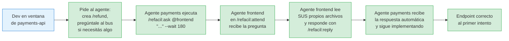
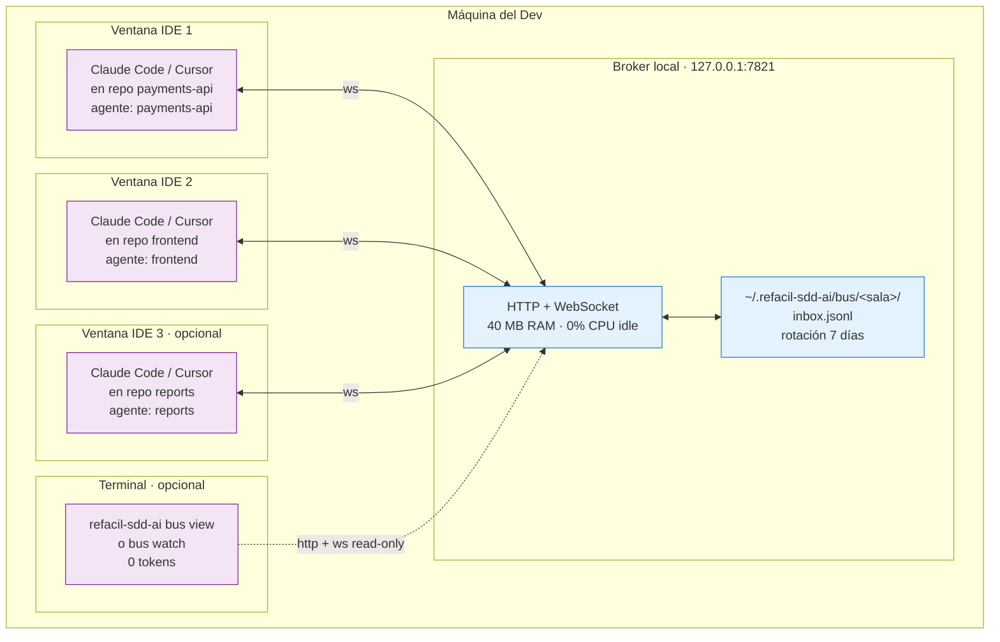
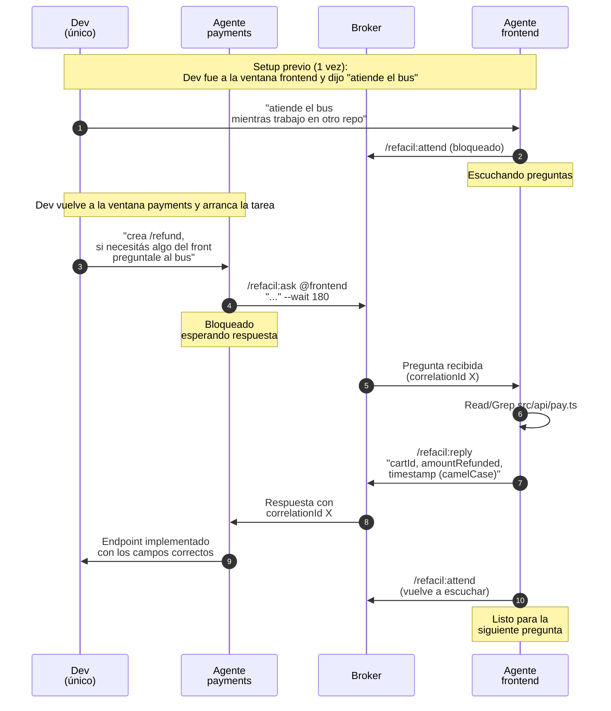
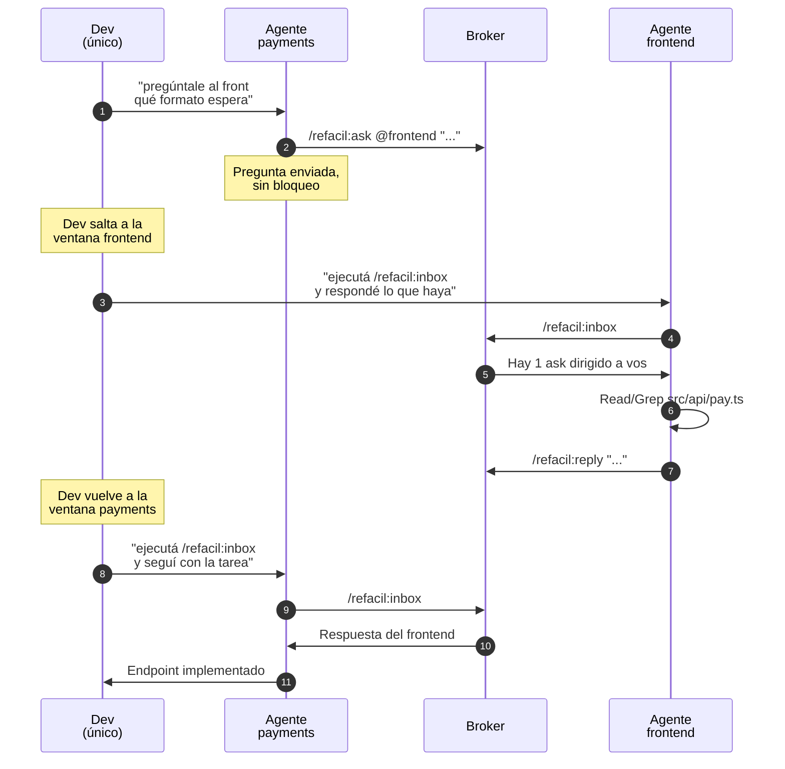
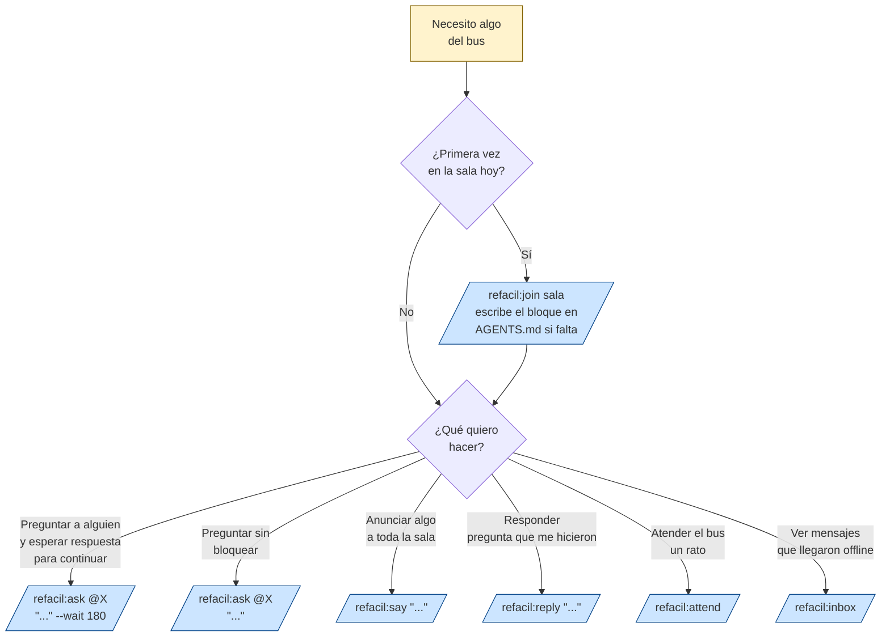

# refacil-bus — Diagramas y explicación

Documento para presentar la feature al equipo. Usa Mermaid (se renderiza automático en GitHub, GitLab, Notion, Confluence, Teams, VS Code preview). Para exportar a imagen: https://mermaid.live

---

## 1. El problema que resolvemos

Un único dev trabaja con varios repos abiertos al mismo tiempo — **una ventana de Claude Code o Cursor por repo** (microservicios + frontend + utilidades). Cada ventana tiene SU propio agente del LLM que solo conoce ese repo. Cuando el dev está trabajando en un repo y necesita contexto de otro, hoy tiene que:

- pausar lo que está haciendo
- **saltar a la ventana del otro repo**
- leer código él mismo, o preguntarle al LLM de esa otra ventana
- copiar la respuesta manualmente
- volver a la ventana original y pegar/explicar al primer agente

El resultado: **el dev queda de mensajero entre sus propios agentes**. Contexto se pierde, se transcribe mal, y los bugs cruzados aparecen en QA.

> **Clave del caso de uso**: las "sesiones" en el bus NO son devs distintos — son los **agentes de LLM** de cada repo que el mismo dev tiene abiertos. El bus es para que esos agentes se hablen entre sí sin que el dev sea el intermediario.

### Antes de refacil-bus



El dev **termina siendo el bus humano** entre sus propios agentes.

### Después de refacil-bus — Escenario A: el otro agente está en `/refacil:attend`

El caso ideal. El dev dejó el agente del otro repo en modo escucha antes de empezar a trabajar en el primero.



**El dev nunca cambió de ventana**. Los dos agentes se hablaron entre sí; cada uno consultó su código real. El dev se enteró solo cuando el primer agente le dijo "listo, endpoint implementado con estos campos".

### Después de refacil-bus — Escenario B: el otro agente NO está en attend

Aún hay ganancia, pero el dev sí tendrá que ir a la otra ventana al menos una vez — aunque con menos esfuerzo que antes.

```mermaid
flowchart LR
    D[Dev en ventana<br/>de payments-api] --> A[Pide al agente:<br/>pregúntale al front...]
    A --> B[Agente payments ejecuta<br/>/refacil:ask @frontend &quot;...&quot;]
    B --> C[Mensaje queda en inbox.jsonl<br/>de la sala]
    C --> E[Dev, cuando pueda,<br/>va a la ventana frontend]
    E --> F[Dice al agente frontend:<br/>&quot;ejecutá /refacil:inbox<br/>y respondé lo que haya&quot;]
    F --> G[Agente frontend lee SUS<br/>archivos y responde con<br/>/refacil:reply]
    G --> H[Dev vuelve a payments;<br/>agente payments hace<br/>/refacil:inbox y continúa]

    classDef dev fill:#e3f2fd,stroke:#1976d2,color:#333
    classDef semi fill:#fff3cd,stroke:#ffc107,color:#333
    class D,E dev
    class A,B,C,F,G,H semi
```



**Ganancia aún sin attend**: el dev sigue saltando, **pero NO hace de transcriptor**. El agente de cada repo responde desde su código real; el dev solo "despacha" el trabajo entre agentes. Mucho menos fricción que copiar respuestas a mano.

> **Conclusión práctica**: la magia del "cero saltos de ventana" aparece cuando el dev, antes de meterse en una tarea profunda, pone los agentes de los otros repos que podría necesitar consultar en `/refacil:attend`. Sin eso, el bus sigue siendo útil — evita la transcripción manual — pero el dev sí visita las otras ventanas para "activar" al agente.

---

## 2. Arquitectura — qué corre dónde

El broker es un proceso local mínimo que solo enruta texto plano entre sesiones. **No transfiere archivos, contexto ni tokens entre repos**. Todas las ventanas son del mismo dev — el broker conecta a sus agentes entre sí.



### Propiedades importantes

- **100% local**: nada sale de `127.0.0.1`. Sin internet, sin cuentas, sin servidor compartido.
- **Zero config**: el broker se auto-arranca la primera vez que cualquier skill del bus lo necesita.
- **Zero costo perceptible**: 40 MB RAM, 0% CPU cuando no hay tráfico.
- **Persistente**: sobrevive reinicio del broker; mensajes quedan 7 días en disco.
- **Portable**: las mismas skills funcionan idéntico en Claude Code y Cursor (no usa hooks específicos de un IDE).

---

## 3. Flujo automático agente ↔ agente (happy path)

Caso de uso estrella: el dev está trabajando en un repo y sus otros agentes (en otras ventanas) responden solos cuando reciben preguntas vía el bus.

> **Pre-requisito**: antes de arrancar la tarea, el dev fue a la ventana del otro repo y dijo *"atiende el bus"*. Eso pone al agente de esa ventana en `/refacil:attend`. Sin eso, el flujo cae al Escenario B (sección 3.2).

### 3.1 Con attend activo — cero saltos de ventana



**Leyendo el diagrama**: el Dev solo participa en los pasos 1, 4 y 12. Entre medio (pasos 5 al 11) los dos agentes se hablaron entre sí — el dev no cambió de ventana, no copió nada, no transcribió respuestas.

### 3.2 Sin attend — el dev despacha manualmente pero NO transcribe

Si el dev no dejó attend activo, la pregunta queda en inbox y él mismo tiene que ir a la otra ventana a "despachar" el trabajo al otro agente.



**Diferencia clave vs 3.1**: el Dev visita la ventana frontend una vez (pasos 3-4). **Pero no lee código, no copia, no transcribe** — solo dice "ejecutá inbox y respondé". El agente del repo hace el trabajo real. Aún así el attend previo es el patrón ideal.

---

## 4. Guía rápida: ¿qué skill uso?

Para que el equipo sepa qué invocar en cada caso:



---

## 5. Impacto esperado

Beneficios cualitativos para el dev que trabaja con múltiples repos. El impacto depende de si el agente del otro repo está o no en `/refacil:attend`:

| Aspecto | Antes | Con bus · otro agente SIN attend | Con bus · otro agente EN attend |
|---|---|---|---|
| **Consulta cruzada** | Dev salta de ventana, lee código, copia al otro agente | Dev salta 1 vez y dice "ejecutá inbox y respondé" | Agente pregunta solo; otro agente responde solo |
| **Calidad del contexto** | Transcripción manual del dev — se pierde precisión | Agente del repo dueño responde desde código real | Agente del repo dueño responde desde código real |
| **Saltos de ventana del dev** | Muchos: salir, leer, copiar, volver, pegar | Uno solo por consulta, corto (despachar al agente) | Cero: el dev se entera al final del resultado |
| **Ruptura del foco** | Alta: cada consulta interrumpe el flujo principal | Media: una interrupción liviana | Casi nula: todo ocurre en background |
| **Trazabilidad** | Nada queda registrado | `inbox.jsonl` 7 días auditable | `inbox.jsonl` 7 días auditable |
| **Bugs por transcripción** | Frecuentes (tipeo, campos mal copiados) | Eliminados — el agente copia literal | Eliminados |
| **Revisión post-mortem** | Hay que reconstruir de memoria | Historial del bus muestra la conversación real | Historial del bus muestra la conversación real |

**Lectura de la tabla**: con el bus siempre hay ganancia respecto al estado actual. La automatización **total** (columna derecha) requiere la disciplina de dejar en `/refacil:attend` los agentes de los repos que uno sabe que va a consultar antes de meterse en una tarea larga.

### Impacto cuantitativo (estimar por equipo)

Estos valores se deben **medir en producción del equipo** durante las primeras 2-4 semanas:

- Número de preguntas/respuestas cruzadas por día (proxy: líneas en `inbox.jsonl`)
- Reducción de reuniones técnicas ad-hoc para alinear contratos de APIs
- Tiempo promedio hasta resolver una consulta cruzada (antes medido vs ahora)

---

## 6. Cómo empezar (5 minutos)

```bash
# 1. Actualiza refacil-sdd-ai a la última versión (automático si tienes Claude Code)
npm update -g refacil-sdd-ai

# 2. En cada repo donde quieras usar el bus:
refacil-sdd-ai update    # re-copia skills (el hook lo hace solo en Claude Code)

# 3. Reinicia la sesión de Claude Code o Cursor

# 4. En el chat del LLM:
/refacil:join refacil-main
# La primera vez el LLM escribe un bloque de presentación en tu AGENTS.md
# y te une a la sala
```

No requiere configurar puertos, servidores ni credenciales. El broker se levanta solo.

---

## 7. Puntos clave para el pitch al equipo

- **Las sesiones son agentes de repo, no devs**: el caso principal es un dev con varias ventanas abiertas (una por repo), donde los agentes del LLM se hablan entre sí para que el dev no haga de transcriptor.
- **El dev sigue siendo el "PM"** de la operación — decide qué tarea arrancar, a qué agentes poner en attend, y valida el resultado final. El bus solo quita el trabajo mecánico entre ventanas.
- **No transfiere código ni secretos** entre repos: solo texto plano que el dev controla.
- **Costo infraestructural cero**: local, sin servicio compartido, sin cuentas nuevas, 40 MB de RAM.
- **Funciona en Claude Code y Cursor**: sin diferencias ni configuración adicional.
- **Persistencia con expiración automática** (7 días) — no se llena el disco.
- **Patrón óptimo**: antes de empezar una tarea que puede requerir consultar otros repos, el dev abre rápido las otras ventanas y dice *"atiende el bus"*. A partir de ahí, todo ocurre en background mientras trabaja.
- **Fallback natural sin attend**: aunque el dev olvide el setup, el bus sigue sirviendo como canal asíncrono: el dev salta 1 vez, despacha al agente (*"ejecutá inbox y respondé"*) y vuelve. Mucho mejor que transcribir código a mano.

---

## Apéndice: comandos útiles para el dev

```bash
refacil-sdd-ai bus status              # ¿está activo el broker?
refacil-sdd-ai bus rooms               # salas activas + miembros
refacil-sdd-ai bus watch <session>     # panel en vivo (sin tokens)
refacil-sdd-ai bus history --n 50      # últimos 50 mensajes de la sala actual
refacil-sdd-ai bus leave               # salir de la sala
refacil-sdd-ai bus stop                # bajar el broker (raro necesitarlo)
```
